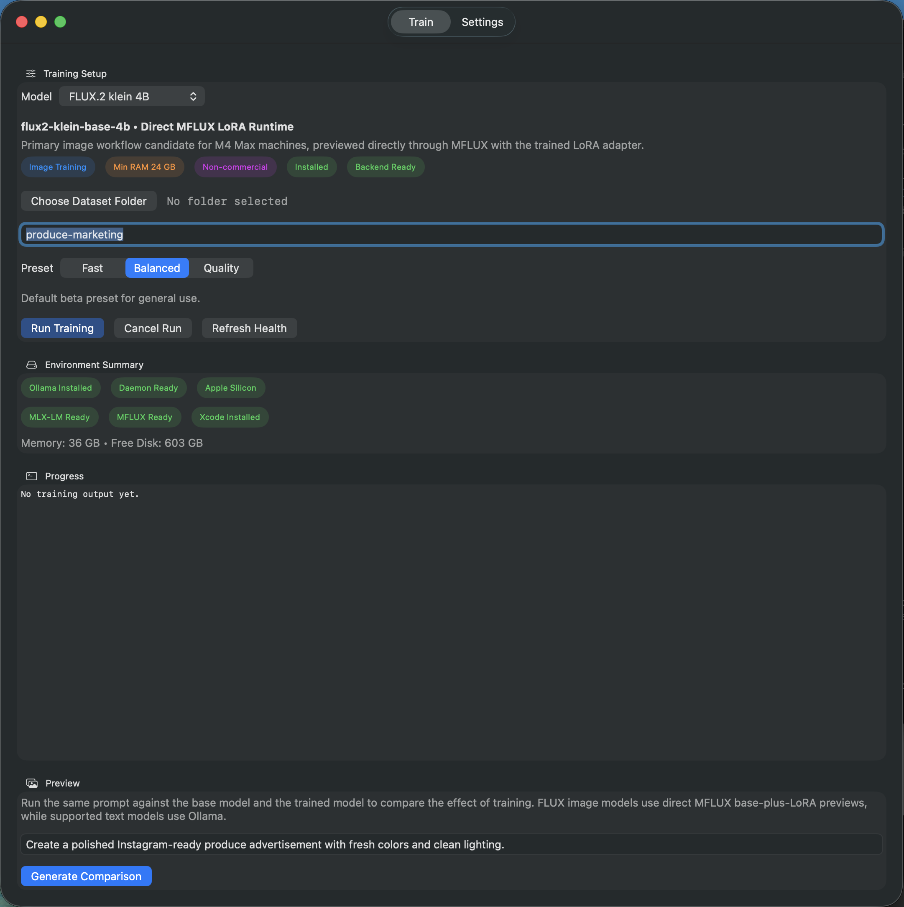

# Local AI Trainer

Local AI Trainer is a macOS desktop app for non-technical users who want to fine-tune local AI models on Apple Silicon without setting up a manual training stack.



## What The App Does

- Lets a user choose a supported local training workflow from a single desktop UI.
- Validates a dataset folder, prepares the dataset, runs fine-tuning, and saves the resulting artifact locally.
- Shows progress, errors, output locations, and a before/after preview from the same app.
- Uses Ollama where it fits well and avoids forcing Ollama into workflows it does not support cleanly.

## Current Product Direction

V1 is now split into two runtime paths:

- Image training:
  - FLUX image models train through MFLUX.
  - The result stays as a direct LoRA adapter artifact.
  - Preview generation runs as `base model` versus `base model + adapter` through MFLUX.
  - FLUX image runs do not try to become new Ollama models in v1.
- Text training:
  - Supported text models train from Hugging Face weights through MLX-LM.
  - The worker fuses the tuned result into a local model directory.
  - The fused model is then imported into Ollama for serving and preview.

This split is intentional. It matches the current backend support reality better than trying to force one packaging path for every model family.

## Supported V1 Workflows

- FLUX.2 klein image fine-tuning on Apple Silicon through MFLUX.
- Text fine-tuning for curated Ollama-compatible families:
  - Llama
  - Mistral
  - Gemma
  - Phi3
- In-app environment checks for:
  - Ollama installed
  - Ollama daemon availability
  - Apple Silicon compatibility
  - memory and disk headroom
  - MLX-LM and MFLUX backend readiness

## UX Shape

- `Train` page:
  - model picker
  - dataset folder picker
  - project name
  - preset selector
  - run / cancel actions
  - progress log
  - output summary
  - before/after preview comparison
- `Settings` page:
  - backend health
  - curated model install status
  - backend setup
  - Hugging Face token storage in the login keychain

## Run Locally

1. Install Ollama and make sure the daemon is available.
2. Launch the app through the dev wrapper:

```bash
./scripts/run_dev_app.sh
```

Why this wrapper exists:

- It builds the Swift target.
- It wraps the executable in a temporary `.app`.
- It launches the app as a normal foreground macOS app so text input and focus behave correctly.

The app prefers the repo-local `.venv/bin/python3` automatically and will attempt to install missing backend runtimes itself. [setup_worker_env.sh](/Users/crissantiago/Documents/AI/Training/scripts/setup_worker_env.sh) remains a fallback for development or recovery, not the primary user flow.

For debugging only, `swift run LocalAITrainerApp` still works, but it can register as a background-style process on current macOS builds and cause input issues.

## Output Locations

Local app output is written outside the repo:

```text
~/Library/Application Support/LocalAITrainer/
```

That includes:

- manifests
- worker logs
- prepared datasets
- checkpoints
- fused text models
- FLUX adapter artifacts

## Repository Layout

- [Sources/LocalAITrainerApp](/Users/crissantiago/Documents/AI/Training/Sources/LocalAITrainerApp): SwiftUI macOS app shell
- [worker/local_ai_trainer_worker](/Users/crissantiago/Documents/AI/Training/worker/local_ai_trainer_worker): Python worker runtime
- [docs/ARCHITECTURE.md](/Users/crissantiago/Documents/AI/Training/docs/ARCHITECTURE.md): architecture summary
- [docs/IMPLEMENTATION_CHECKLIST.md](/Users/crissantiago/Documents/AI/Training/docs/IMPLEMENTATION_CHECKLIST.md): live execution checklist and run log
- [PLAN.md](/Users/crissantiago/Documents/AI/Training/PLAN.md): current product and delivery plan

## V1 Status

Core app flows are in place:

- desktop shell
- environment checks
- curated model registry
- dataset validation and preprocessing
- text fine-tuning pipeline
- FLUX image fine-tuning pipeline
- progress and failure handling
- before/after preview UI

Remaining v1 work is mostly:

- end-to-end validation on the updated text and FLUX workflows
- downstream validation of trained models in the target app flow
- signed `.app` / notarized `.dmg` packaging with bundled Python dependencies

## Important Constraints

- Full release packaging still requires full Xcode.
- FLUX image workflows stay in direct MFLUX adapter form in v1.
- Ollama import is reserved for the supported text-model families.
- The app intentionally exposes a curated model list instead of every local Ollama model.

## Repo Hygiene

- Do not commit local runs, generated artifacts, temporary import-test folders, or crash logs.
- Private or regulated datasets should stay out of the repository.
- Local app artifacts belong under `~/Library/Application Support/LocalAITrainer/`, not in the repo.
